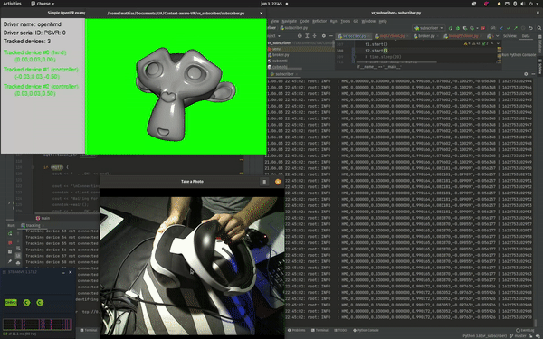
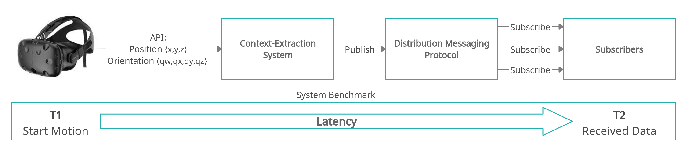
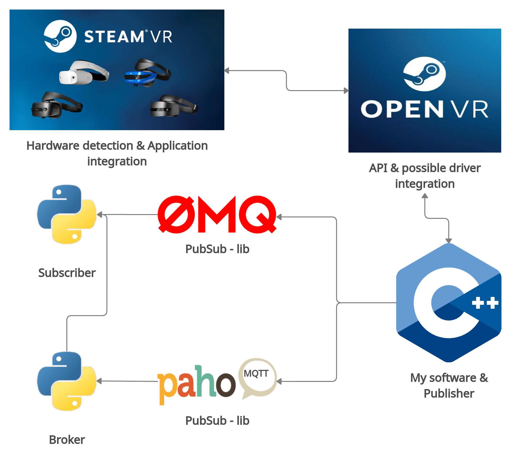

# CAVR: Context-Aware-VR 



YouTube:
- HTC Vive: https://youtu.be/3XEQG9NMxoM
- PlayStation VR: https://youtu.be/SxlgeaNkngw

# INFO

CAVR is a general, future-proof design thatexports multiple types of context information that are sent over anetwork interface. This design works for basically all VR-HMDs, with the help of community-supported tools.  
Details around this project can be found in: [CAVR](CAVR.pdf)

# DESIGN & IMPLEMENTATION
The theoretical design and used software to implement this design:




 
# INSTALL

First clone this repository:

```
git clone https://github.com/Charles-Derek/Context-Aware-VR.git
```

To build the Context-Extraction system, navigate to the third-party directory under vr_tracking:

```
cd Context-Aware-VR/vr_tracking/third-party
```

Make the three main install scripts executable:
```
chmod +x packages.sh cppzmq.sh mqtt.sh
```

First we install all necessary packages, check if any errors occur!
```
./packages.sh
```
Next, we install the ZMQ library, check if any errors occur!
```
./cppzmq.sh
```
Finally, we install the MQTT library, check if any errors occur!
```
./mqtt.sh
```

All necessary software should be installed and we can test the Context-Extraction system.
To build IT, use the CMakeLists.txt under Context-Aware-VR/vr_tracking/CMakeLists.txt

To test the system, don't forget to first install Steam \& SteamVR, once SteamVR detects the HMD correctly the system should work.


The subscriber that shows the visualization is located in vr_subscriber called subscriber.py.
For MQTT you need to run an additional instance broker.py
